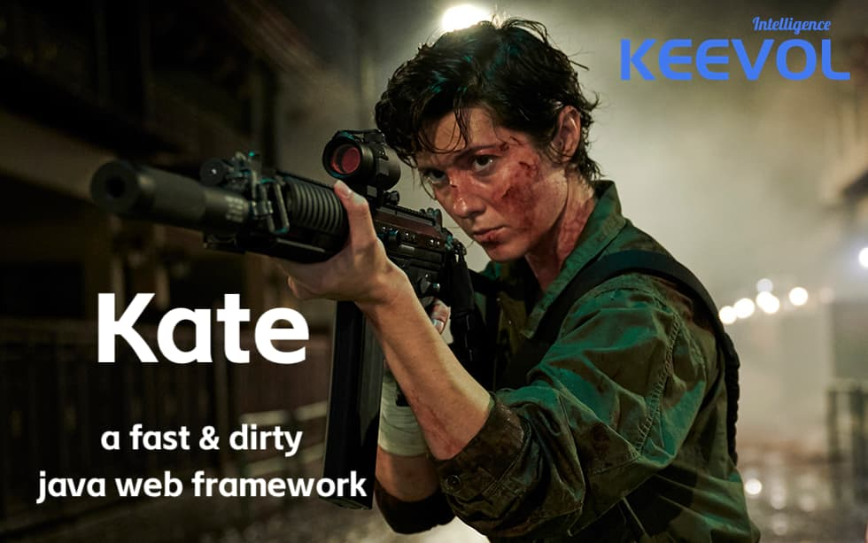

# Intro

a fast and dirty java web framework



# Prerequisites

Java19+

# Quick Start

```java
KateHandler sampleHandler = new KateHandler() {
    @Override
    String route() {
        return "/";
    }
    @Override
    public void handle(RoutingContext ctx) {
        ctx.response().end("DONE!");
    }
};
Kate kate = new Kate(new KateHandler[]{sampleHandler});
kate.start("localhost", 9999);
System.in.read();
kate.stop();
```

If you would like to use spring/springboot, annotate your `KateHandler`(s) with `@Component/@Service/@Repository...` annotations to enable auto-scan and auto-wire to ease your DX(Developer Experiences).

> NOTE
> 
> The order of `KateHandler`(s) matters!
> That's why array(or list) is as bootstrap parameters' holder.

# TIPS

## Fancy transition to make MPA a SPA

Although Kate is mainly for MPA(that's, multi-page applications), but you can still achieve SPA effect via js library, let's say, [Barba.js](https://barba.js.org/) 


# License

MIT

# Credit

to [WangFuqiang](https://afoo.me) @ [KEEVOL.com](https://keevol.com)
